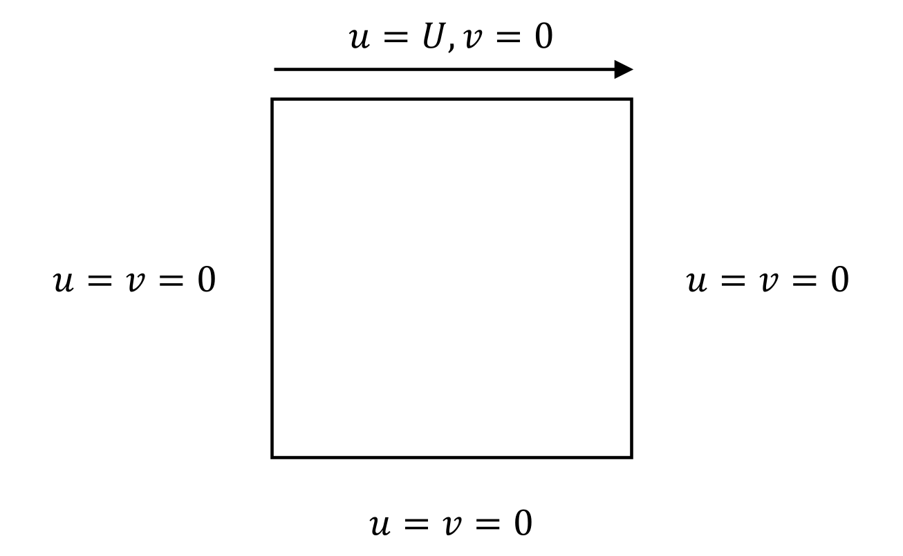
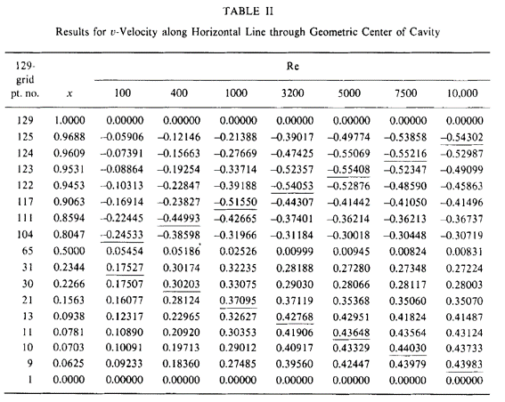
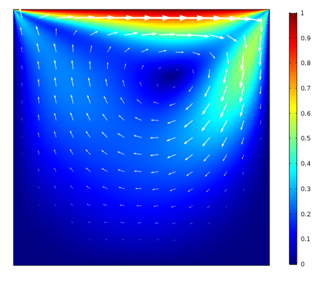
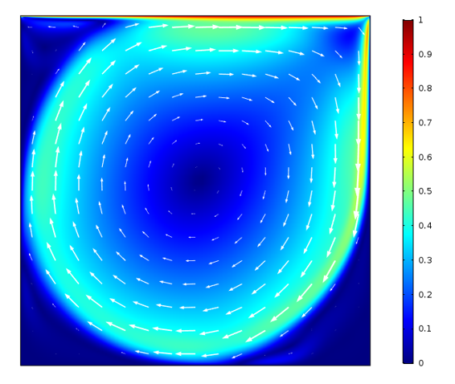

# Tutorial 1.1 – Introduction to CFD Concepts and OpenFOAM

##  Table of Contents
- [Tutorial 1.1 – Introduction to CFD Concepts and OpenFOAM](#tutorial-11--introduction-to-cfd-concepts-and-openfoam)
  - [Table of Contents](#table-of-contents)
  - [Introduction](#introduction)
  - [Overview](#overview)
  - [Governing Equations](#governing-equations)
    - [Continuity Equation](#continuity-equation)
    - [Momentum Equations](#momentum-equations)
    - [Assumptions](#assumptions)
  - [Nondimensionalization](#nondimensionalization)
  - [Benchmark for Lid-Driven Cavity Problem](#benchmark-for-lid-driven-cavity-problem)
  - [References](#references)

## Introduction

In this tutorial, you'll learn the process of setting up and simulating the lid-driven cavity case using **OpenFOAM** (Open Field Operation and Manipulation), an open-source software suite developed primarily in C++ for CFD. 

**OpenFOAM** provides a broad range of tools for modeling various aspects like fluid flow, turbulence, heat transfer, and chemical reactions. Its modular structure lets users customize features to meet specific needs of their projects. The software includes diverse solvers and utilities suited for everything from simple, incompressible flows to complex, chemically reactive flows in large industrial environments. **OpenFOAM** uses a finite volume method (FVM) to translate the Navier-Stokes equations that describe fluid motion into algebraic equations that can be solved numerically. This method is especially useful for handling intricate geometries and boundary conditions, making **OpenFOAM** a solid choice for both academic research and industrial applications.

Being open-source, **OpenFOAM** is not only budget-friendly but also supported by a dynamic community of developers and users. This community actively contributes to its ongoing development and documentation, providing substantial resources, tutorials, and user guides to help newcomers navigate the complexities of CFD software.

With this overview of OpenFOAM's capabilities, let's move on to the practical steps involved in setting up and executing the lid-driven cavity problem.

## Overview

The lid-driven cavity problem is a classic benchmark test in CFD, where you simulate the flow inside a square cavity with a side length $'L'$. The top boundary, or lid, moves uniformly at a constant velocity $'U'$ in the positive x-direction, while the other sides remain stationary. This setup induces a recirculating flow pattern within the cavity, making it an excellent test case for validating numerical solvers. The problem is simple in terms of geometry and boundary conditions but presents complex flow features, such as vortices, that challenge numerical methods.

Here is a schematic of the problem:



## Governing Equations

The flow inside the cavity is governed by the incompressible Navier-Stokes equations, which consist of the continuity equation and the momentum equations. These equations are expressed as follows:

### Continuity Equation

```math
\nabla \cdot \textbf{u} = 0 
``` 

This equation ensures the conservation of mass in the flow field, where $`\textbf{u}`$ is the velocity vector.

### Momentum Equations

```math
\rho(\frac{\partial \textbf{u}}{\partial t} + \textbf{u} \cdot \nabla \textbf{u}) = -\nabla p + \mu \nabla^2 \textbf{u}
```

These equations represent the conservation of momentum, where $`\rho`$ is the fluid density $`\textbf{u}`$ is the velocity vector, $`t`$ is time, $`p`$ is the pressure, $`\mu`$ is the dynamic viscosity.

### Assumptions

To simplify the problem, we make the following assumptions:
1. Incompressible flow: The density of the fluid remains constant throughout the simulation.
2. Newtonian Fluid: The fluid viscosity remains constant, and the fluid follows Newton's law of viscosity.
3. No-slip Condition: The fluid velocity at the stationary walls is zero, and at the moving lid, it matches the lid's velocity.
4. Laminar Flow: The Reynolds number is low enough to avoid turbulence, ensuring a smooth and stable flow.
5. Steady-State Flow: We focus on the steady-state solution where the flow does not change with time, meaning the time derivative term $`\frac{\partial \textbf{u}}{\partial t}`$ is set to zero.

## Nondimensionalization

When introducing CFD simulations in your coursework, it's crucial to understand how to use benchmark cases effectively. Benchmark cases are established scenarios with well-documented results that serve as a standard for comparing and validating your own simulation results. This helps ensure that the software and models you develop are accurate and reliable. 

Let’s explore how you can use nondimensionalization to simplify this process and make your simulations universally applicable. 

Nondimensionalization involves converting key physical quantities into dimensionless forms, which helps abstract the problem from specific physical scales and conditions:

1. Velocity: $`\textbf{u}^* = \frac{\textbf{u}}{U}`$, where $`U`$ is a reference velocity. 
2. Pressure: $`p^* = \frac{p}{\rho U^2}`$, relating to fluid density $`\rho`$.
3. Spatial dimensions: $`\textbf{r}^* = \frac{\textbf{r}}{L}`$, $`L`$ being a characteristic length, affecting the gradient operator $`\nabla^* = L\nabla`$.

These adjustments lead to a dimensionless form of the momentum equation:

```math
\textbf{u}^* \cdot \nabla^* \textbf{u}^* = -\nabla p^{*} + \frac{1}{Re} \nabla^{*2} \textbf{u}^{*}
```

Here, $`Re`$ represents the Reynolds number ($`Re = \frac{\rho UL}{\mu}`$). This number is pivotal as it indicates the relative significance of inertial forces compared to viscous forces in fluid flow. As the Reynolds number increases, the relative influence of the viscous term diminishes compared to the inertial term. This shift indicates a transition toward flow regimes where inertial effects dominate, such as in high-speed flows or turbulent conditions. The inertial term’s nonlinearity contrasts with the linearity of the viscous term, thus an increase in Reynolds number leads to more nonlinear behavior in the fluid flow.

When utilizing codes for CFD simulations, it's important to note that most of them are programmed to solve the dimensional governing equations directly. However, when employing benchmark cases that use nondimensional variables for comparison and validation, you need to adjust the material properties within your simulations to mimic the behavior of solving nondimensional equations. In the dimensionless momentum equation the coefficient before the inertial term $`\textbf{u}^* \cdot \nabla^* \textbf{u}^*`$ is 1, suggesting that we should set the density $\rho$ to 1 in our simulation's material properties. Similarly, the coefficient of the viscous term $`\nabla^{*2} \textbf{u}^*`$ is $`\frac{1}{Re}`$, indicating the need to set the viscosity $`\mu`$ in correlation to the Reynolds number $`Re`$.

By carefully adjusting the input parameters in **OpenFOAM** to align with the nondimensionalized equations used in your benchmark cases, you can effectively simulate and study various fluid dynamics scenarios under controlled and comparable conditions. This approach not only facilitates a more profound understanding of fluid behavior across different scenarios but also ensures that your simulations are robust, reliable, and directly comparable to established benchmarks. 

## Benchmark for Lid-Driven Cavity Problem

The lid-driven cavity problem has been extensively studied both for laminar and turbulent flows, with various numerical techniques applied to compute these solutions. A pivotal source of benchmark data for this problem comes from the study by [Ghia, Ghia, and Shin (1982)](https://www.sciencedirect.com/science/article/abs/pii/0021999182900584), which provides detailed tabular results across a range of Reynolds numbers. These results are crucial for verifying the accuracy of CFD simulations, ensuring that the software can replicate well-established outcomes.

<details>
<summary> Tabular results for various of Reynolds numbers by Ghia, Ghia, and Shin (1982). </summary>
&nbsp;

 

</details><br>

Further validation can be achieved by comparing our results with those generated using other advanced CFD tools, such as **[COMSOL](https://www.comsol.com/)**. COMSOL has documented its approach to solving the [lid-driven cavity problem](https://www.comsol.com/blogs/how-to-solve-a-classic-cfd-benchmark-the-lid-driven-cavity-problem), providing another layer of benchmarking data.

<details>
<summary> COMSOL simulation results for Reynold number 100 and 10,000. </summary>
&nbsp;

    
<p align="center"> Figure: The magnitude and direction of the flow in a cavity. </p>

</details><br>

Having established the importance of the lid-driven cavity problem as a benchmark in validating CFD simulations, let’s now delve into how to set up and execute this case in **OpenFOAM**, providing a step-by-step guide to ensure accurate and reproducible results.

## References

[https://www.comsol.com/blogs/how-to-solve-a-classic-cfd-benchmark-the-lid-driven-cavity-problem](https://www.comsol.com/blogs/how-to-solve-a-classic-cfd-benchmark-the-lid-driven-cavity-problem)   

[https://www.cfd-online.com/Wiki/Lid-driven_cavity_problem](https://www.cfd-online.com/Wiki/Lid-driven_cavity_problem)