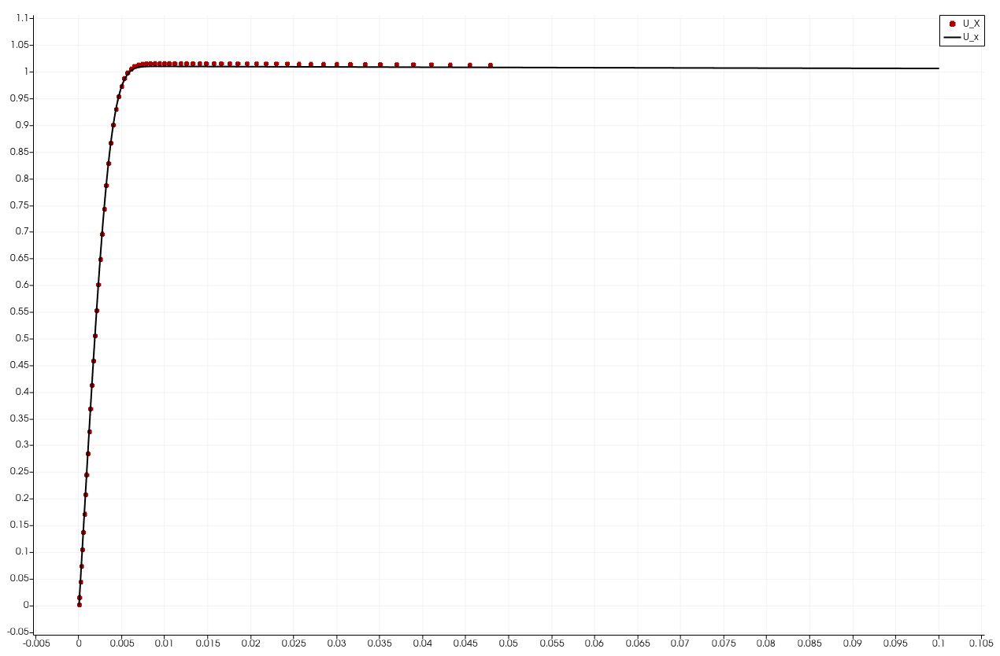
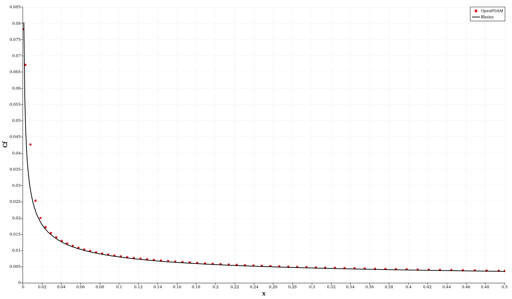

# Tutorial 2.3 – Running the Simulation and Post-Processing

##  Table of Contents
- [Tutorial 2.3 – Running the Simulation and Post-Processing](#tutorial-23--running-the-simulation-and-post-processing)
  - [Table of Contents](#table-of-contents)
  - [Introduction](#introduction)
  - [Running the Simulation](#running-the-simulation)
  - [Post-Process Wall Shear Stress](#post-process-wall-shear-stress)
  - [Visualizing Results](#visualizing-results)
  - [Exploratory exercises](#exploratory-exercises)
  - [References](#references)

## Introduction

In this section, we will run the simulation, monitor its progress, and analyze the results. The steps include generating the mesh, running the simulation, monitoring convergence, and post-processing the results.

## Running the Simulation

First, generate the mesh using the "blockMesh" utility and verify the quality of the generated mesh using the "checkMesh" utility:

```bash
blockMesh && checkMesh
```

The "checkMesh" utility performs various checks on the mesh, including:
- Geometry checks: Ensures non-orthogonality, skewness, and aspect ratio of cells are within acceptable limits.
- Topology checks: Confirms connectivity and boundary definitions.
- Additional quality checks: Checks for non-positive volumes and other potential issues.

Review the output to ensure there are no critical errors. Address any warnings or errors related to mesh quality before proceeding. Important aspects to check include:

Start the simulation using the "foamRun" command:

```bash
foamRun > log &
```

Monitor the progress in real-time:

```bash
tail -f log
```

Press <kbd> Ctrl+C </kbd> to exit the log viewer once the simulation completes.

To visualize the residuals and ensure convergence, process the "log" file using "foamLog":

```bash
foamLog log
```

This command creates a directory named "logs" containing files for each quantity's residuals and other metrics.

For instructions on creating the Gnuplot script to plot the residuals, refer to the residuals plotting section in the previous tutorial.

## Post-Process Wall Shear Stress

The "[foamPostProcess](https://doc.cfd.direct/openfoam/user-guide-v11/post-processing-functionality)" utility provides various post-processing functionalities to analyze simulation results. Some common functionalities include:
- Field data extraction: Extracting specific fields (e.g., velocity, pressure) at different locations or times.
- Derived quantities: Calculating derived quantities like vorticity, shear stress, and turbulence quantities.
- Data conversion: Converting data formats for compatibility with different visualization tools.


For this case, we will use it to calculate the wall shear stress:

```bash
foamPostProcess -solver incompressibleFluid -func wallShearStress
```

The wall shear stress is an important parameter in boundary layer analysis, representing the tangential force exerted by the fluid on the wall due to viscosity. Understanding the distribution of wall shear stress helps in analyzing the boundary layer characteristics and potential flow separation points.

## Visualizing Results

Create a ".foam" file to enable visualization in **ParaView**:

```bash
touch plate.foam
```

Transfer the simulation data to your Windows system for visualization by using the following command:

```bash
cp -r $FOAM_RUN/laminar_flatplate /mnt/c/Users/YourUserName/Downloads/
```

Replace "YourUserName" with your actual Windows username.

Visualizing the results in **ParaView**:
1. Open **ParaView** from your Windows start menu and load "plate.foam" file.
2. Visualize "U_x" and mesh edges. Here is what you should see if everything is done correctly:   

   

   The mesh is significantly refined near the bottom boundary, where the no-slip wall is located. The fine mesh near the wall will help in resolving the velocity and shear stress profiles within the boundary layer. The vertical grading helps in transitioning from a fine mesh near the wall to a coarser mesh away from it, reducing the total number of cells while maintaining accuracy where needed. The cells near the wall have a high aspect ratio (they are much longer in the x-direction than in the y-direction). This is appropriate for boundary layer simulations where the velocity changes rapidly in the y-direction but more gradually in the x-direction. However, care must be taken to ensure that the aspect ratio is not too extreme, as it can affect numerical stability and accuracy.
 
3. To analyze the boundary layer development, plot the velocity profile $`U_x`$ at $`x = 0.1`$. 
   - Use the "Plot Over Line" filter:
     - Sampling Pattern: Sample At Segment Centers
     - Point1: (0.1, 0.0, 0.05)
     - Point2: (0.1, 0.1, 0.05)
     - X Array Name: Points_Y
     - Series Parameters: U_x
     - Line Style: None
     - Marker Style: Circle
     - Marker Size: 7.0 
  
   - Apply the filter and compare the obtained velocity profile to the Blasius solution for a boundary layer ([u_x_x01.csv](u_x_x01.csv)).

     
4. Calculate and plot the skin friction coefficient ($`C_f`$).
   - Go to the toolbar and click on the "Calculator" button. 

     
   - In the "Calculator" properties panel, which appears after selecting the tool, use the following expression:

     
   - Use the "Plot Over Line" filter to plot $`C_f`$:
      - Sampling Pattern: Sample At Segment Centers
      - Point1: (0.0, 0.0, 0.05)
      - Point2: (0.5, 0.0, 0.05)
      - X Array Name: Points_X
      - Series Parameters: Cf
      - Line Style: None
      - Marker Style: Circle
      - Marker Size: 7.0 
   - Apply the filter, compare the obtained $`C_f`$ profile to the Blasius solution for a boundary layer ([Cf_Blasius.csv](Cf_Blasius.csv)).

     

## Exploratory exercises

In this exploratory exercise, you will solve the Hagen-Poiseuille flow problem using **OpenFOAM** version 11. The Hagen-Poiseuille equation describes the pressure-driven flow of an incompressible and Newtonian fluid through a cylindrical pipe. The case setup and boundary conditions are provided in the following [link](https://wiki.openfoam.com/Hagen_Poiseuille_by_Joel_Guerrero), but you will need to adapt it to **OpenFOAM** version 11.

Steps to follow:
1. Download the case files from the provided link.
2. Review the case setup and understand the boundary conditions and physical properties defined in the case.
3. Set up the case in **OpenFOAM** version 11.
4. Transfer the simulation data to your Windows system and visualize the results in **ParaView**.
5. Compare the simulation results with the analytical solution for Hagen-Poiseuille flow.
6. Plot the velocity profile across the pipe diameter and the pressure drop along the pipe length.
  
Expected Outcomes:
- Verify that the velocity profile matches the parabolic profile predicted by the Hagen-Poiseuille equation.
- Ensure that the pressure drop along the pipe length is consistent with theoretical predictions for $`Re = 100`$.

## References
[https://su2code.github.io/tutorials/Laminar_Flat_Plate/](https://su2code.github.io/tutorials/Laminar_Flat_Plate/)   
[https://openfoamwiki.net/index.php/Blasius_Flat-Plate_Flow_Benchmark](https://openfoamwiki.net/index.php/Blasius_Flat-Plate_Flow_Benchmark)
[https://cfdmonkey.com/verification-of-flow-over-a-flat-plate-in-openfoam/](https://cfdmonkey.com/verification-of-flow-over-a-flat-plate-in-openfoam/)


